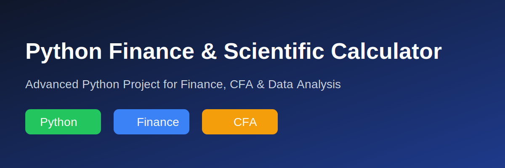

# Python Finance & Scientific Calculator



An advanced Python calculator project featuring:

## Basic Operations
- Addition
- Subtraction
- Multiplication
- Division
- Modulo

## Scientific Features
- Power calculations
- Square root
- Percentage calculator

## Finance Features
- Simple Interest
- Compound Interest
- EMI Calculator
- SIP Returns Calculator
- CAGR Calculator
- IRR Calculator

## Testing
Includes unit tests using Python unittest.

## Run
```bash
python calculator.py
```

## Run Tests
```bash
python test_calculator.py
```

## Future Improvements
- GUI using Tkinter
- Voice calculator
- Currency converter
- Streamlit web app
- Stock market integration

Created by Naga.
